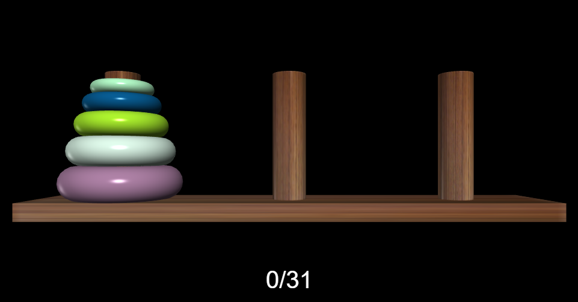

# HANOI TOWER
This litte project is inspired by polish youtuber SciFun [video](https://www.youtube.com/watch?v=iG4lHkfuu8I).
___
### About (via [Wikipedia](https://en.wikipedia.org/wiki/Tower_of_Hanoi)):
**Tower of Hanoi** is a mathematical game or puzzle consisting of three pillars and a number of rings of various diameters, which can slide onto any rod. The puzzle begins with the rings stacked on one pillar in order of decreasing size, the smallest at the top, thus approximating a conical shape. The objective of the puzzle is to move the entire stack to the last pillar, obeying the following rules:
1. Only one ring may be moved at a time.
1. Each move consists of taking the upper ring from one of the stacks and placing it on top of another stack or on an empty pillar.
1. No ring may be placed on top of a ring that is smaller than it.

The minimal number of moves required to solve a Tower of Hanoi puzzle is 2^n − 1, where n is the number of disks.

Whole project was realized in VPython. It took less than 70 lines of code to create Hanoi Tower solver with an optimal (2^n-1 moves) solution. The following was possible due to implementation of a following iterative sollution:

For an even number of disks:
- make the legal move between pillars A and B (in either direction),
- make the legal move between pillars A and C (in either direction),
- make the legal move between pillars B and C (in either direction),
repeat until complete.

For an odd number of disks:
- make the legal move between pillars A and C (in either direction),
- make the legal move between pillars A and B (in either direction),
- make the legal move between pillars B and C (in either direction),
repeat until complete.

The color of the rings is randomly selected from the RGB palette. Since the available colors are 255^3, the probability of hitting two identical is very small. The length of the piles and the time between successive iterations scale with the number of rings. Since the solution is optimal, we immediately know how many moves the algorithm will need to solve the tower, therefore, below the tower, the current move and the total number of moves left to be made are displayed.

Since the relationship between the number of rings and the number of moves to made is exponential, the number of moves quickly tends to infinity.

One of the advantages of using Visual Python is that you can easily create beautiful simulations that do not cost the computer a lot of memory. You can also rotatea and zoom them suring the run.

